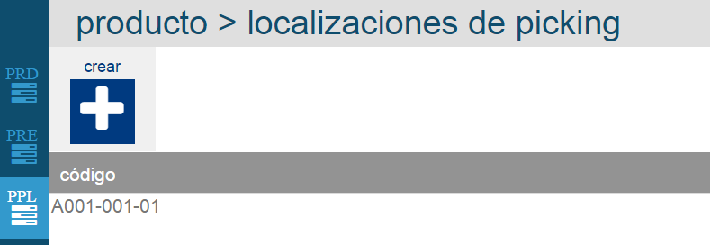
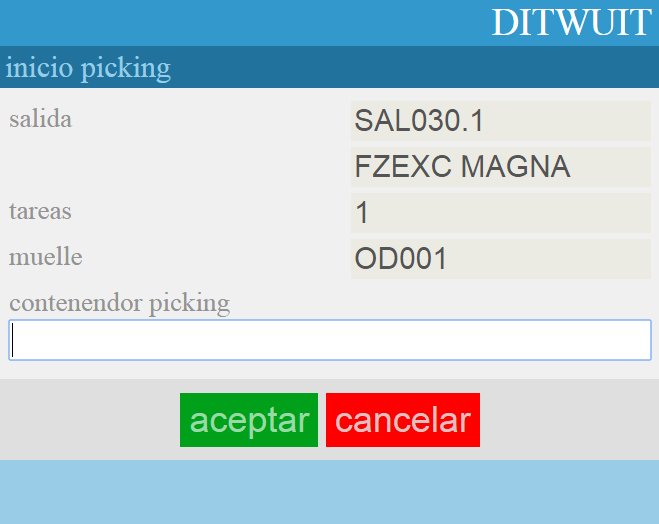
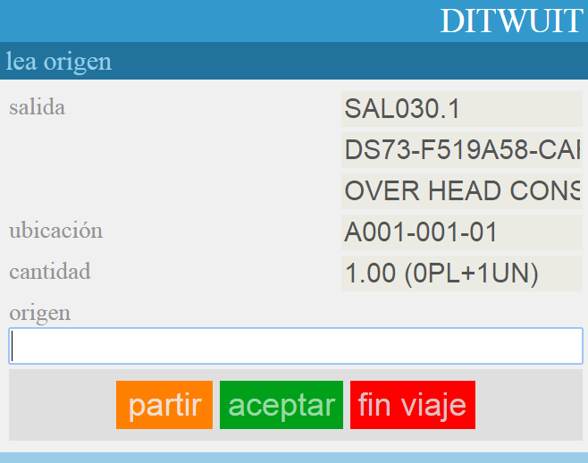
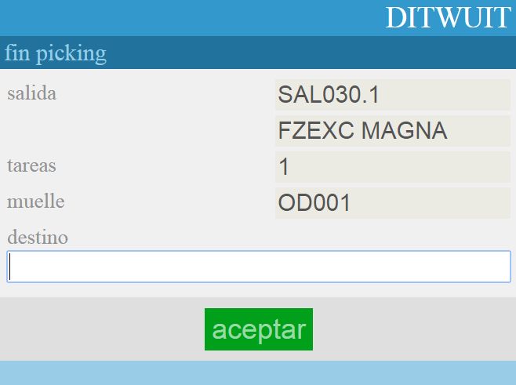

.. index:: pair: Funciones; Picking

.. _picking:

Picking
---------------------
El proceso de picking consiste en la preparación de cantidades inferiores a un palet completo. Normalmente, los restos de palets suelen colocarse en ubicaciones específicas.

Para preparar el picking, eEl artículo debe tener asignada una ubicación a la que el sistema dirigirá para hacer el picking. Esta ubicación se configura en el maestro de productos en la pestaña Localizaciones de Picking.

Al analizar la tarea de picking desde el programa de radiofrecuencia **Picking básico**, dirigirá al operario a la ubicación de picking asignada siempre que tenga stock disponible en esa ubicación. Leer la matrícula de contenedor de picking (etiqueta contenedor vacía):

   
Mostrará la cantidad a preparar y la ubicación donde se encuentra y solicitará la lectura de la **matrícula del pallet** del cual se va a extraer la mercancía:

   

La opción partir, permite dividir la acción de picking en dos. Solicita la lectura de la ubicación de muelle de destino.

   

Y se finaliza la preparación.

.. image:: ../images/Funciones/ProcesoFinalizado.png
   :scale: 50%
   :align: center
   

