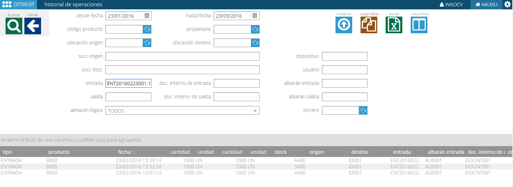

.. index:: pair: Funciones; Crear Entrada

.. _crear-entrada:

Crear Entrada
----------------------------------------
.. image:: ../images/Entradas/Entrada.png  
   :scale: 50%
   :align: left 

Crear una **entrada** es el paso siguiente a realizar tras :ref:`crear-orden-de-entrada` para poder recibir mercancía. Para crear una entrada siempre debe existir una orden de entrada ya que, finalmente, siempre existe una orden para realizar dicha recepción, sea verbal o por interfaz.

.. image:: ../images/Entradas/Entrada/Entrada_DatosPrincipales.png  
   :scale: 50%
   :align: left 

Desde datos principales es posible introducir la siguiente información (en su mayor parte generada desde la orden de entrada)

- **Orden de entrada**.
- **Transportista**.
- **Documento interno**.
- **partida**. Partida aduanera
- **Albarán**. 
- **Tipo contenedor**. Información para el caso de recibir contenedores (20", 40",...)
- **Fecha esperada**.
- **Estado**. Dato informativo del estado de la entrada (Pendiente, parcialmente recibida,..)
- **Comentarios**. Comentarios de la recepción.
- **Muelle**. Muelle de descarga de la mercancía.

Otra información no obligatoria: matrícula de contenedor, precinto, certificado mto. aduanero, fecha certificado, conocimiento de embarque.

.. image:: ../images/Entradas/Entrada/Entrada_LineasDeEntrada.png  
   :scale: 50%
   :align: left 

Una vez introducidos los datos es posible introducir la información de la línea de entrada. Las opciones son las mismas que las indicadas para crear una línea en :ref:`crear-orden-de-entrada`.

El siguiente paso es crear los bultos. en **DITWUIT** es necesario descomponer la información de la línea en las unidades logísticas a recibir. Esto puede ser hecho de tres formas:

- Descomponer en bultos. Desde esta acción es posible crear, con la información de las unidades logísticas de los productos, el desglose de la mercancía a recibir.
- Validación. Desde esta opción de radiofrecuencia es posible validar una mercancía a partir de una etiqueta GS1 emitida por proveedor. Si se lee un SSCC que no existe en DITWUIT solicita la información del producto creándose el mismo.
- Entrada de producción. Al igual que la validación, la entrada de producción crea desde el terminal de radiofrecuencia la información a partir de la etiqueta GS1 asociada al palet de la línea de producción solicitando la lectura de los identificadores de aplicación (IA) necesarios para tener la información del artículo.

.. image:: ../images/Entradas/Entrada/Entrada_Bultos.png  
   :scale: 50%
   :align: left 

Al descomponer en bultos se obtiene el detalle de bultos a recibir. Una vez descompuesto en bultos es posible ejecutar las siguientes acciones:

- **Eliminar bultos pendientes**. Si no se va a proceder a validar dichos contenedores y se desean eliminar de la entrada.
- **Validar**. Permite dar por recibidos los bultos. Equivale a la opción de radiofrecuencia :ref:`validacion`.
- **Finalizar Entrada**. Da por finalizada la entrada. Cambia el estado de la entrada de recibida o parcialmente recibida a finalizada.
- **Cerrar Entrada**: Da por cerrada una entrada finalizada. En estado finalizada una entrada puede ser modificada a nivel de cabecera. En estado cerrado esto no es posible.

- **Historial de operaciones**. Es posible consultar la historia de la entrada.
- **Eliminar trabajo**. Elimina los trabajos de ubicación generados al validar.

También es posible emitir los siguientes documentos:

- **Hoja de descarga**. Documento para comprobar que la mercancía a recibir está correcta en cantidad y en bultos.
- **Justificante de descarga**. Comprobante de la entrega.
- **Etiquetas bultos**. Permite emitir las etiquetas de los bultos a recibir. Esto es necesario siempre que se descompone en bultos.
- **Generar interface**. Genera el interface hacia el ERP.

Finalmente es posible consultar videos con tutoriales de cómo proceder en las entradas.

   

