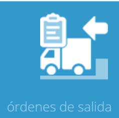
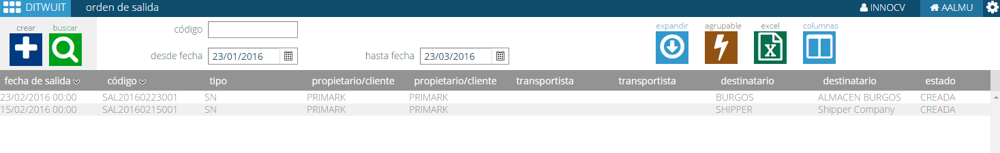
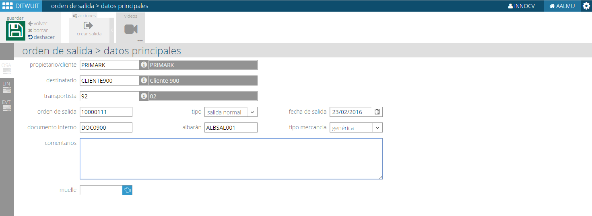
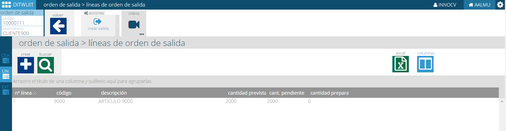
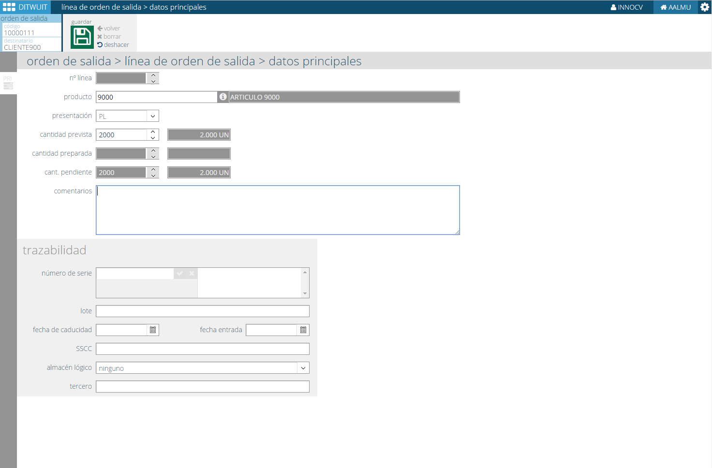

.. index:: pair: Funciones; Crear Orden de Salida

.. _crear-orden-de-salida:

Crear Orden de Salida
----------------------------------------

   
Desde esta opción es posible crear y/o consultar una orden de salida. 

Con esta opción es posible consultar las órdenes de salida existentes para seleccionar alguna o bien proceder a crear una nueva.

Desde esta opción se accede a los datos de cabecera de la orden de salida pudiendo indicar un muelle destino donde desplazar la mercancía una vez preparada.

Una vez creada la orden de salida se puede proceder a crear/consultar las líneas correspondientes.
   

   
A nivel de línea se puede indicar la cantidad a preparar siendo posible indicar datos de trazabilidad para coger un lote o fecha de caducidad concreta.

Una vez creada la orden de salida se puede ejecutar la acción :ref:`crear-salida` para proceder a la preparación de la mercancía.
