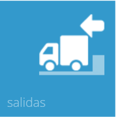
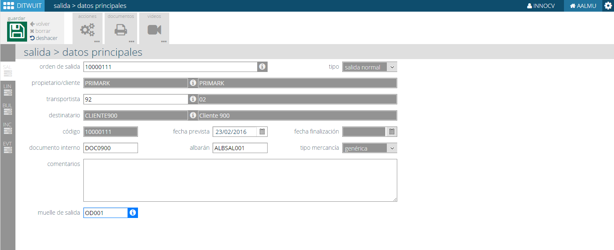
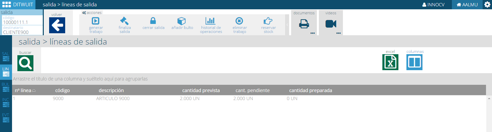

.. index:: pair: Funciones; Crear Salida

.. _crear-salida:

Crear Salida
----------------------------------------

   
Una salida permite preparar la mercancía solicitada en una orden de salida. Pueden existir varias salidas por orden de salida.

   
Desde esta opción se puede completar la información de la cabecera de la salida asignándole fecha prevista, albarán y muelle de salida.

Una vez actualizada la cabecera se procede a mostrar las líneas de la salida teniendo varias posibilidades.

- **Generar trabajo**. Genera los trabajos para que los operarios procedan a preparar la mercancía.
- **Finalizar salida**. Da por terminada una salida.
- **Cerrar Salida**. En este momento ya no es posible modificar la cabecera de la salida.
- **Añadir bulto**. Es posible añadir bultos para cubrir mercancía no servida durante el proceso de preparación.
- **Historial de operariones**. Permite consultar los movimientos relacionados con esta salida.
- **Eliminar Trabajo**. Permite eliminar el trabajo generado.
- **Reservar stock**. Permite reservar stock para la salida.

Desde esta opción es posible también emitir documentos que facilitan la operación (Mercancía preparada, trabajos preparación, lista de contenido,...)