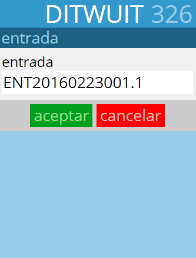
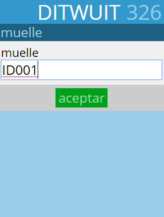
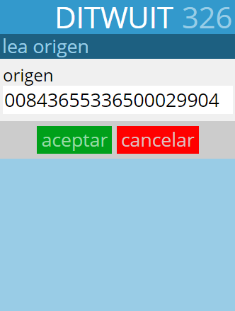
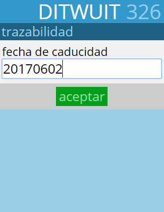
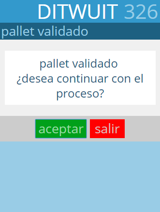

.. index:: pair: Funciones; Validación de Bultos

.. _validacion-de-bultos:

Validación de Bultos
---------------------
.. image:: ../images/Funciones/Validacion.png  
   :scale: 50%
   :align: left 

El proceso de validación de bultos consiste en la lectura de las etiquetas de bultos previamente generadas desde :ref:`crear-entrada` para registrar la entrada de dichos bultos en el almacén.

   
Primero se solicita el código de la entrada a validar.

A continuación se solicita el muelle. Es la ubicación donde se va a registrar el bulto como ubicado una vez se valide.

   
Seguidamente se pide que se lea el contenedor a validar.
 
|
 
|

|
 
|

|

|

|

   
A continuación, si el artículo requiere algún tipo de trazabilidad (lote, fecha de caducidad,...) se solicita dicha información.

   
Una vez finalizado el proceso de validación del bulto se procede, si está así parametrizado, a mostrar el mensaje de palet validado para proceder con el siguiente.

 

   

