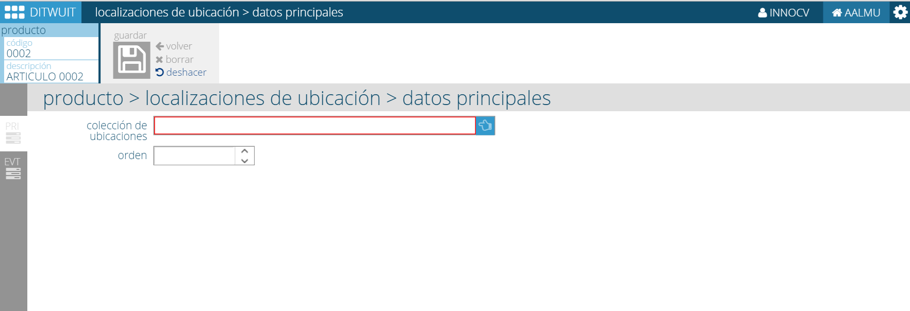

.. index:: pair: Producto; Localizaciones de Ubicación

Localizaciones de Ubicación
---------------------------

Desde esta opción es posible definir las ubicaciones donde se va a poder almacenar la mercancía. Se puede seleccionar una **colección de ubicaciones** que tendrá asociada las ubicaciones donde se puede tener almacenado el producto.

Dado que se pueden definir diferentes colecciones de ubicaciones es necesario establecer el orden en el que se usarán para ubicar la mercancía.

Es posible consultar los eventos de la entidad.

